# Apps and Dashboard

## Goal

The goal of this lab is to understand General Data Protection
Regulation (GDPR) requirements, its impact on your organization, and how
ServiceNow can help your compliance journey to GDPR. ServiceNow
Governance, Risk, and Compliance (GRC) helps bring order to an
enterprise's compliance requirements to GDPR. It provides best practices
to meet the GDPR requirements.  
This lab explains key ServiceNow
application to support GDPR and names the key citations (regulatory
requirements) for GDPR.

Getting Started -- Log on to Your Training Instance 
====================================================

1.  Navigate to the unique instance URL provided to you. 


2.  Log on with the provided credentials. 


3.  Review your homepage.  
    You can change your homepage to System Administration by selecting it from the dropdown list in the top-left of the page. \
    \
    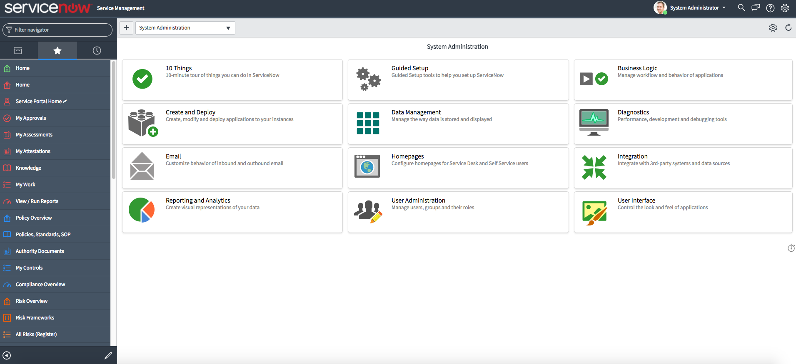

4.  Review your favorite applications by clicking the **star**
     next to the application.

    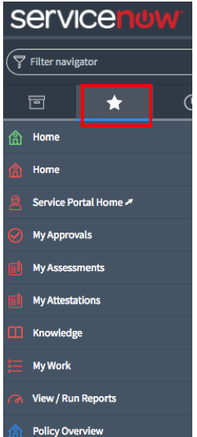

5.  Discover the GRC applications and its modules by typing the first few
    letters of **Policy and Compliance**, **Risk Management**, or **Audit
    Management**.\
    \
    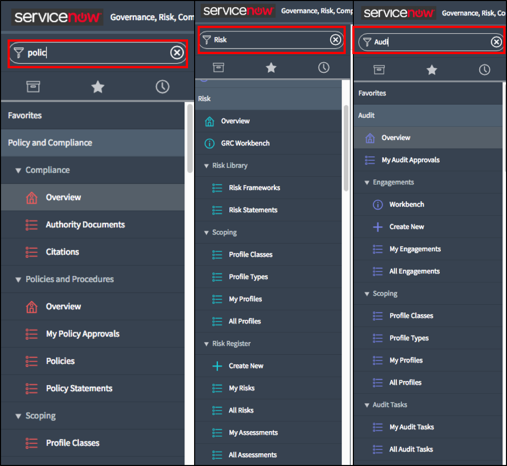  
  
  
Check Your Homepage
===================

1.  Click the **ServiceNow** logo.

    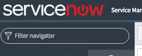

2.  In the homepage window, from the dropdown list, search for compliance.

    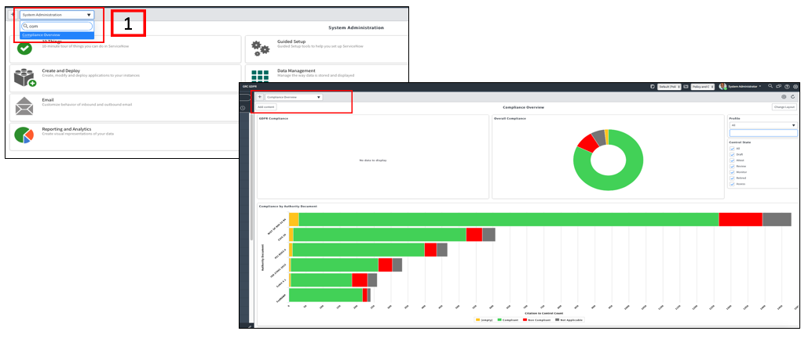

3.  Select **Compliance Overview**.

4.  Review the initial Compliance status.  
    You should see the **GDPR Compliance**
    report as empty for now. The related **gauges/reports** are updated
    as you progress with the lab.

# Authority Document GDPR

## Goal

This lab explores the GDPR authority document. It also explains the
different citations for regulatory requirements.

## GDPR Authority Document

1.  In the **Filter Navigator**, enter **authority**, and then click **Authority Documents**.

3.  Under **Authority Documents**, in the **Common Name** field, search for **\*EU**.

    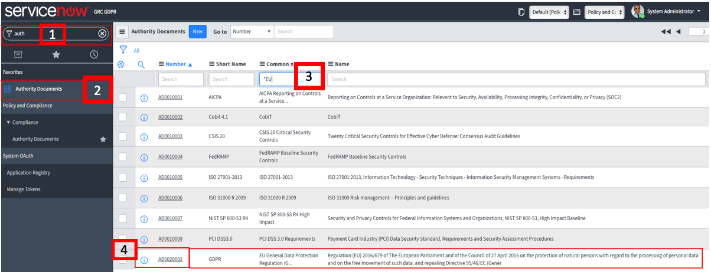  

    **Note:** Refer to the example below. If your **Type** field for **EU GDPR** Authority Document is empty, you can add the relevant type by double-clicking on the empty field.
    
    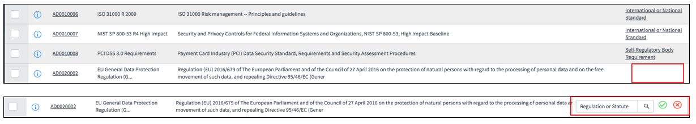

4.  Click the **EU General Data Protection link (begins with AD00)**.  
    You might have different authority document number.

5.  Review the overall **GDPR** information.

6.  Scroll to **Related Lists** and click **Citations**.

7.  In the **Reference** field, search for **Art. 35**.

8.  Review the relevant article, information, and respective subsections.

    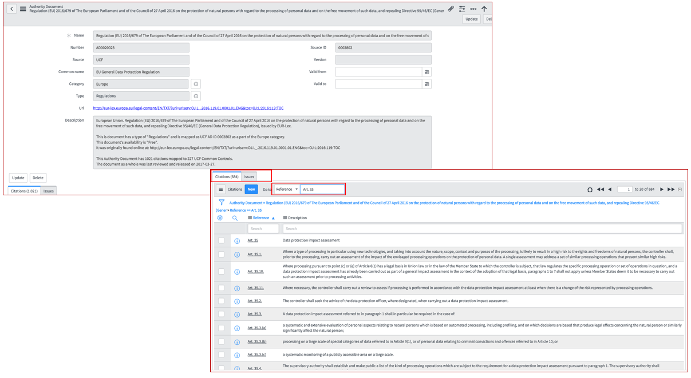

# Policy Creation

## Goal

This lab explains how to create an organizational policy and policy statements that matches requirements and describes the outlines for GDPR.

## Policy Creation

1.  Navigate to the **Policy & Management** application.

2.  Search for **Policies**, and then click **Policies** to list them.

3.  At the top of the policies page, click **New**.

    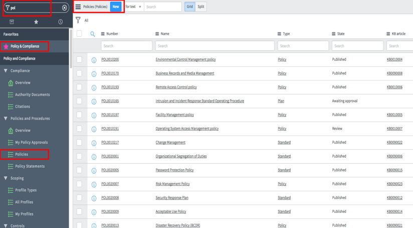

5.  On the top of the
    record, a full **Policy Life Cycle Stages** list appears.

6.  Fill out **New Policy Record** with input as shown below.  
    You can click the
    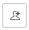 icon to add yourself (**System
    Administrator**) or click the lock icon to add **Policy
    Approver**.
    
    * Name: Data Protection Policy
    
    * Owner: Policy Owner
    
    * Type: Policy
    
    * Owning group: Policy Management
    
    * Description: Data Protection Policy
    
    
    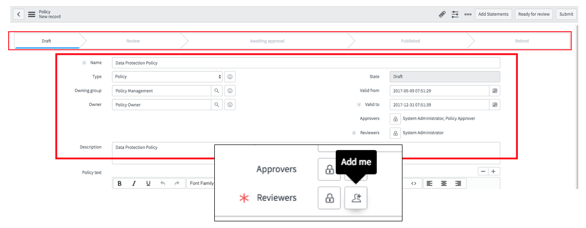
    
    **Note:** For the purpose of this lab, you can provide any valid dates. For simplicity, we have skipped any additional Policy Reviewer step here.

7.  To save the record, right-click the **Policy Record bar**, open the dropdown menu, and then click **Save**.

    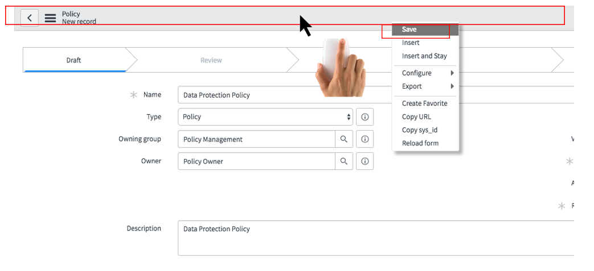
    
8.  In the Filter Navigator, enter **Knowledge**.

9.  Click **Knowledge** application.

    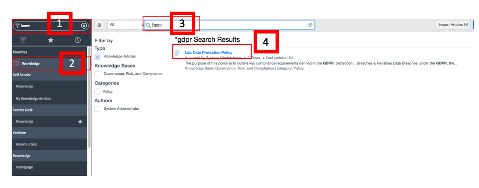
    
10. In the search bar, search for **\*gdpr**. Press enter to continue.

    You see a Lab Data Protection Policy.

11. Open the **Policy**.

12. The **Lab Data Protection policy** describes the different sections required for a Data Protection policy.  
    Review the policy content.

    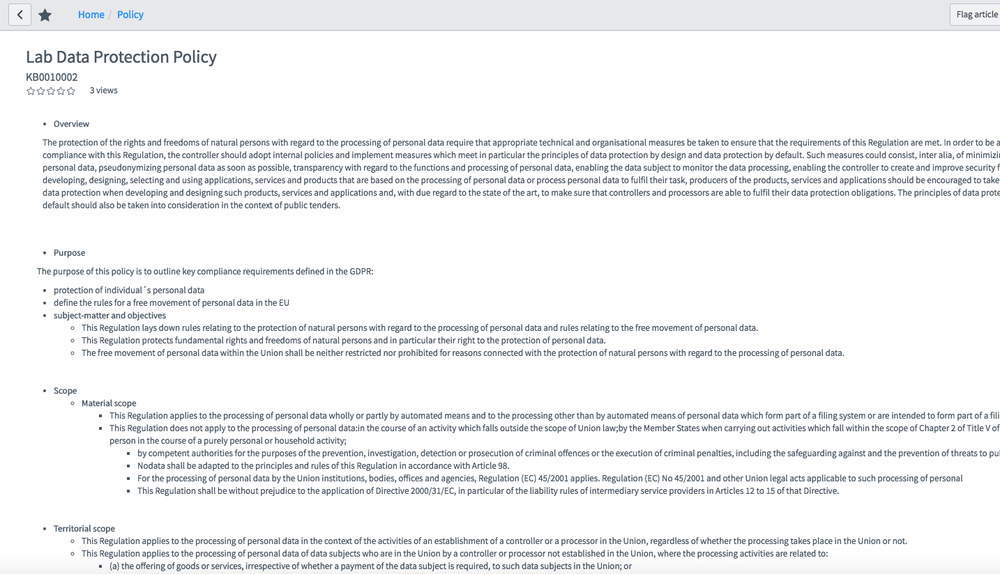

13. Copy the content of the Lab Data Protection Policy.

14. Click on the history to return to your policy.
    ( icon. 
    
15.    Click the **Policy** you just created. You should be now back in the Policy Record.
    
    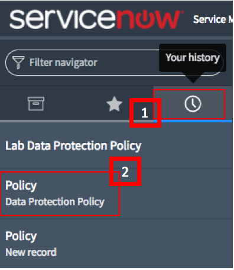

16. Paste the copied content into **Policy Text** field.

17. Right-click in the header bar and then click **Save** to save the record.

    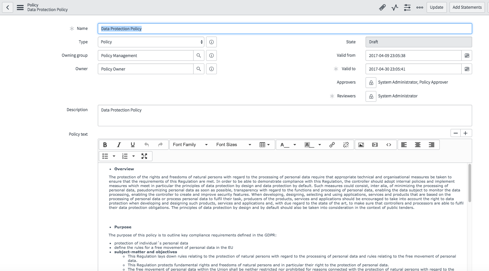
    
18. Assign relevant **Policy Statements** to the Policy.
    
19. Click **Add Statements** to generate Policy Statements that are defined for the policy.
    
    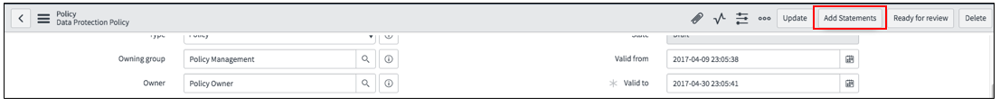

20. Scroll to Related Lists and click **Policy Statements**.  
    You see nine policy statements added to the Policy.

    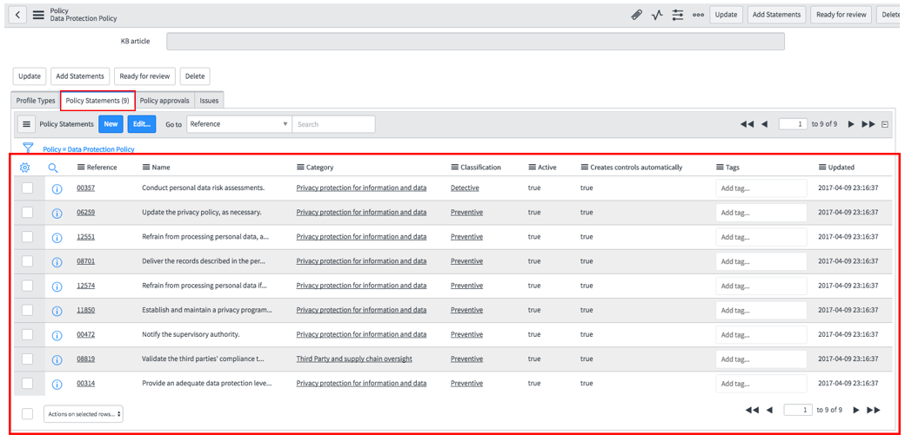
    
21. Click any Reference number; for example 00357.  
    A Policy Statement window opens with underlying reference number. 
    
22. Under Related Lists, click the **citations** tab and verify that at least one EU GDPR Regulation citation is aligned with that policy statement.

    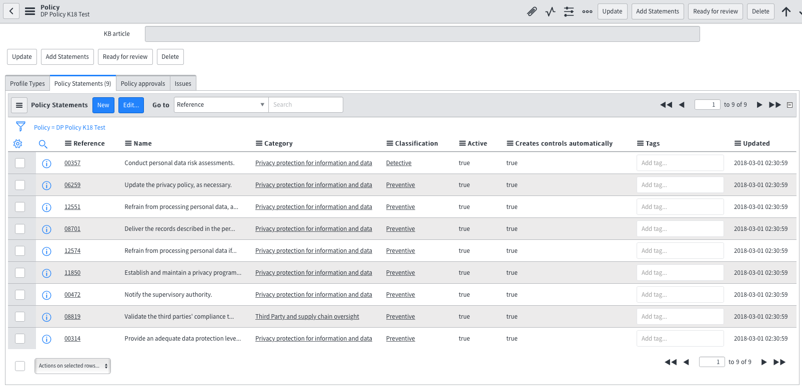

23. Navigate back to your policy.

24. Move forward into Policy Life Cycle. 

25. Go to the next stage and click **Ready for Review**.

    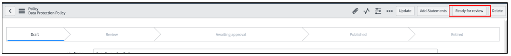  

    The policy moves to the **Review** stage in the Life Cycle Flow. A reviewer can now review the Policy. 

26. For this lab, go directly to the **Approval** step.

27.  Click **Request Approval**.  
     Approval request goes to **Policy Approver** & **System Administrator**.  
     The policy form field now becomes read-only as shown below in the second example.\
    \
    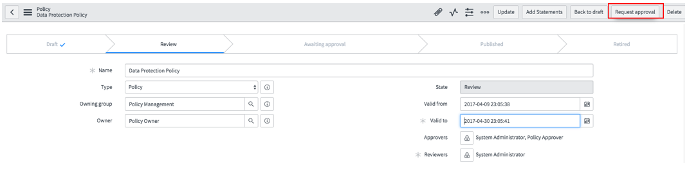
    
    

    After requesting approval, policy life cycle state changes to **Awaiting approval** as shown below.

    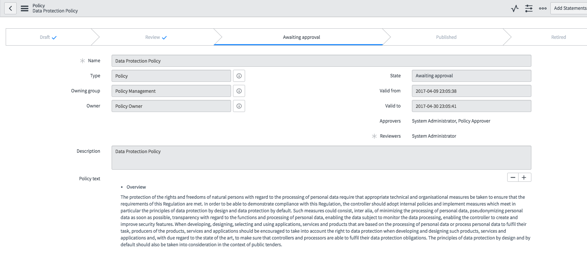
    
28. Scroll to Related Lists and click **Policy Approvals**.

    

    There are two records waiting for approvals.  
    
29. Double-click next to **Requested** at the end of the word and then select **Approved** for each approver.

    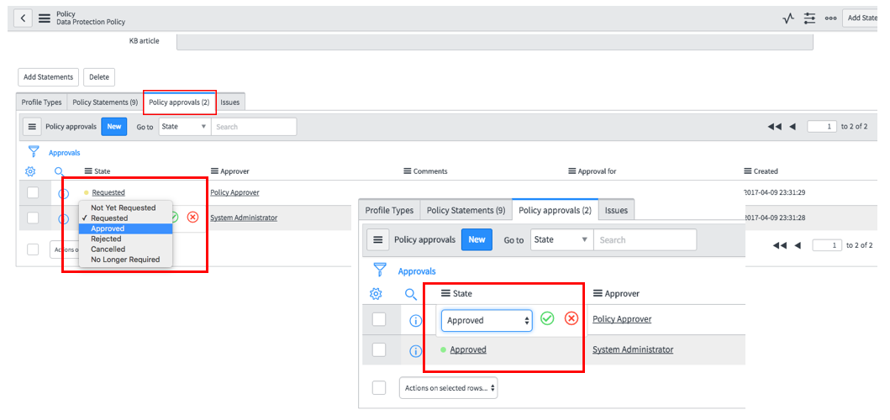

30. Reload the form. 
    The Policy Record has moved to the **Published** state. Also, a Knowledge Article has been published.
    
    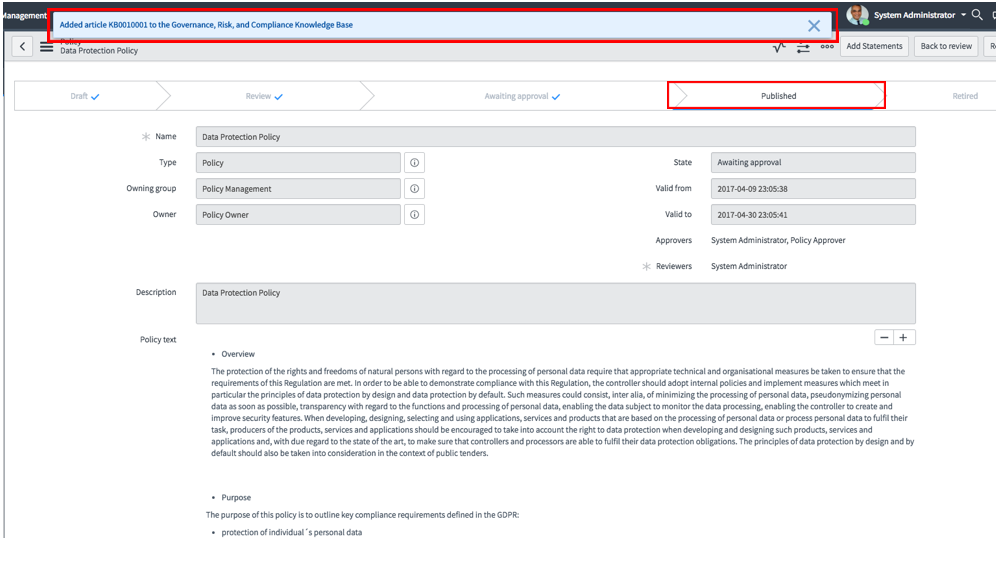

31. Scroll to **KB Article** and click the information
    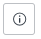 icon at the end of the line.
    
    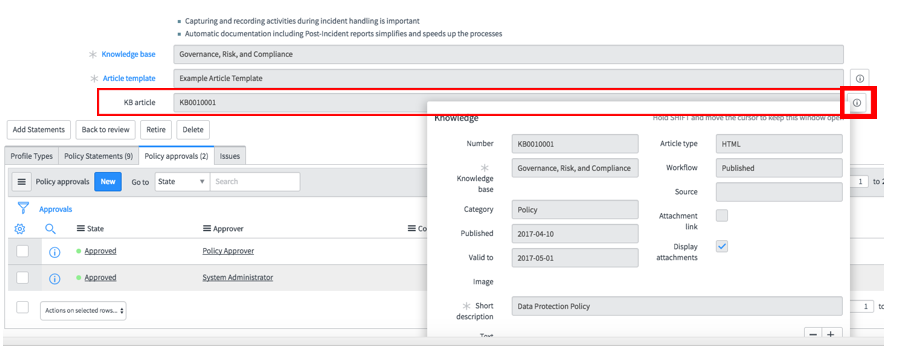

    A Knowledge record window opens.  
    
32. Under **Related Links**, scroll to **View Articles**.

33. Click **View Article**.

    The KB Article has automatically been created with related requirements listed at the bottom of the article.

    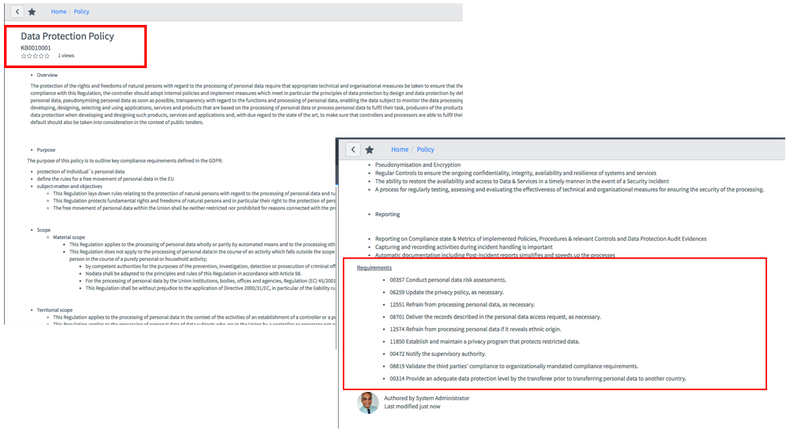

You have just created a Policy aligned with regulation requirements. You have completed a full Policy Life Cycle.

# Profile Type, Profile, and Risks

## Goal

This lab explains how to create a Profile Type and assign a Risk Framework to assess compliance requirements for a profile. A profile -- *An entity we need to check for compliance requirements ---* will then have the associated policy and policy statements you just created. You add risks to the Profile Type and see what could be the potential impact of noncompliance to a profile.

## Profile Type, Profile, and Risk Framework

1.  Click the history icon to return to the Policy Record. (as in Lab 2.0)

1.  Scroll to Related Lists and then, in the Policy record, click **Profile Type**.

2.  Under **Profile Type**, click **Edit**.  

    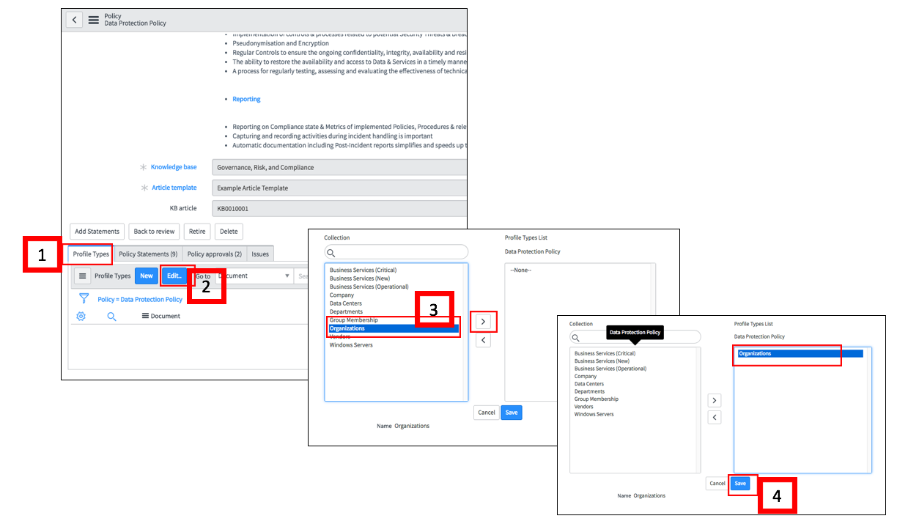

3.  Click **Organizations**, move it into the right window, and then click **Save**.  

    You return to the Policy record. 

4.  Scroll down to the **Profile Type** related list and click **Organizations**.

    The **Profile Type** record opens in a new window. A **Profile**, **ACME Inc**., is assigned to this Profile Type.  

    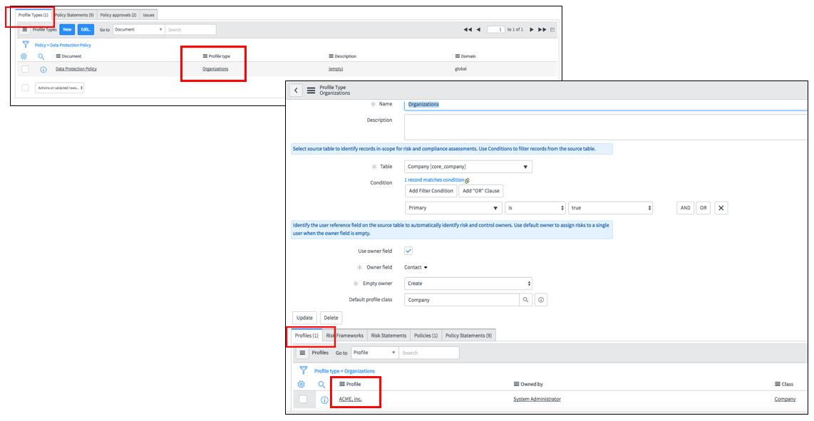  

    The **Policies** and **Policy Statements** created in earlier steps appear in the related list.

6.  Return to the Dashboard and check **Compliance Overview**.  
    The **GDPR Compliance** gauge is created in an empty status.

    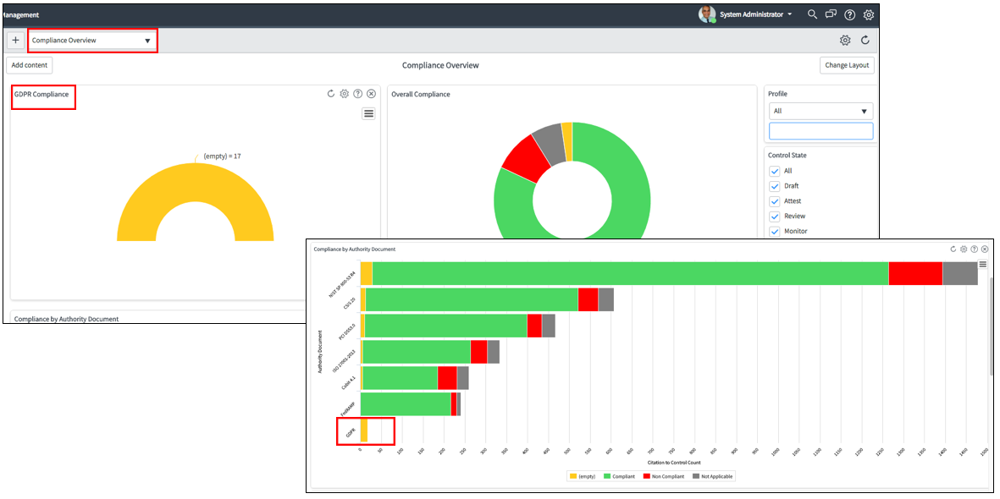
    
7.  Add **Risk Framework** to the **Profile Type** as shown below. 

    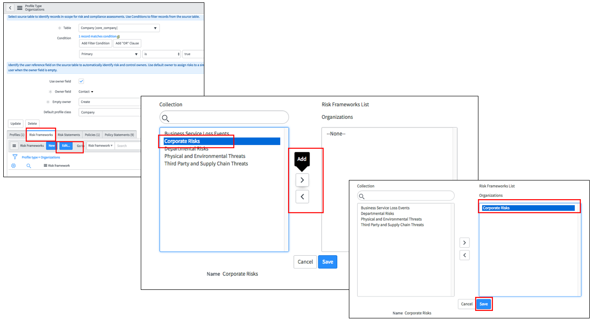
    
8.  Add **Corporate Risks** to Profile type and click **Save**.  
    Corporate risks are related to the regulation requirements. The **Risk Framework** is now assigned to **Profile Type**.
    
9.  Reload the form.  
    The **Risk Statements** are also automatically added to that **Profile Type**.  

    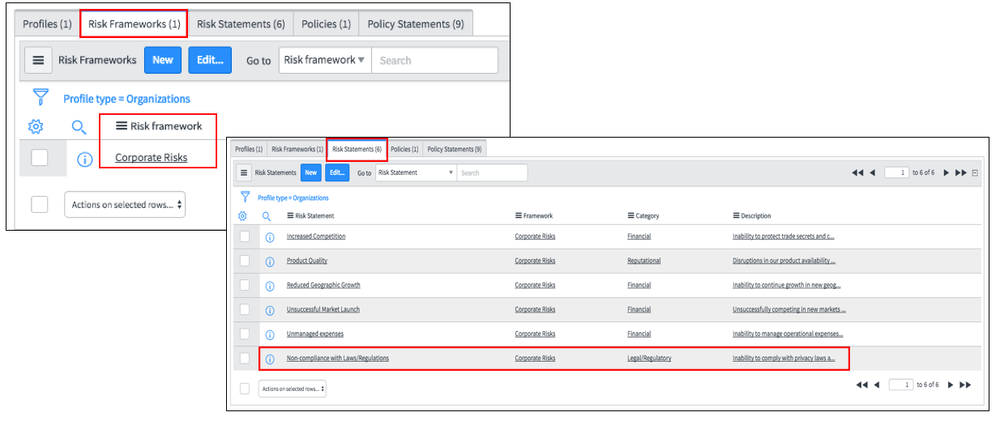
    
10.  Click **Risk Statements** to see assigned **Risk Statements**.  

    You should have some **Risk Statements (6)**, including **Non-compliance with Law/ Regulations**. You revisit this **Risk Statement** later.

11. Under Related Lists, return to **Profile**, and then click the profile **ACME Inc**.

    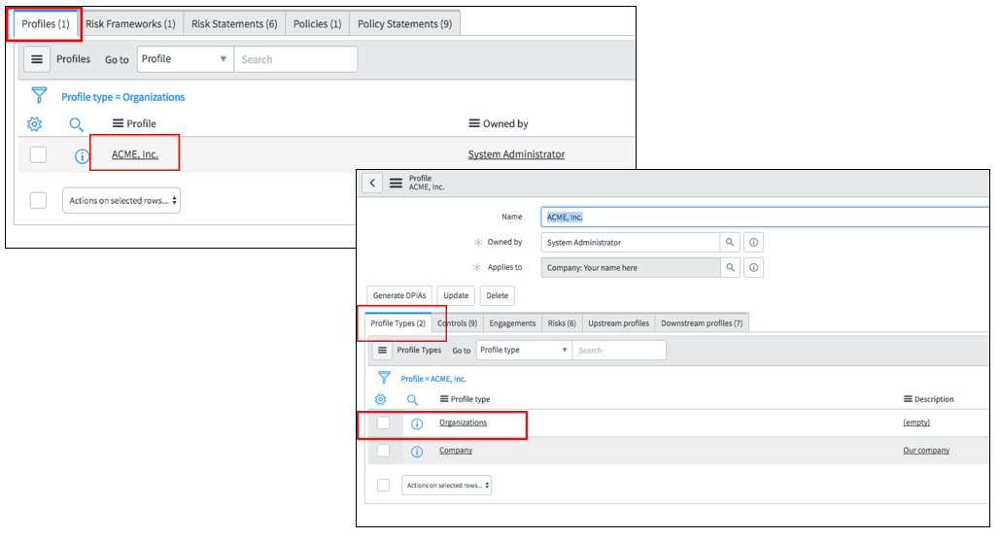

    The Profile window contains **Organizations** in the **Profile Type** related list.

12. Click the **Controls** tab next to **Profile Type**.  
    There are nine controls allocated to this **Profile** as requirements described in the Policy.

    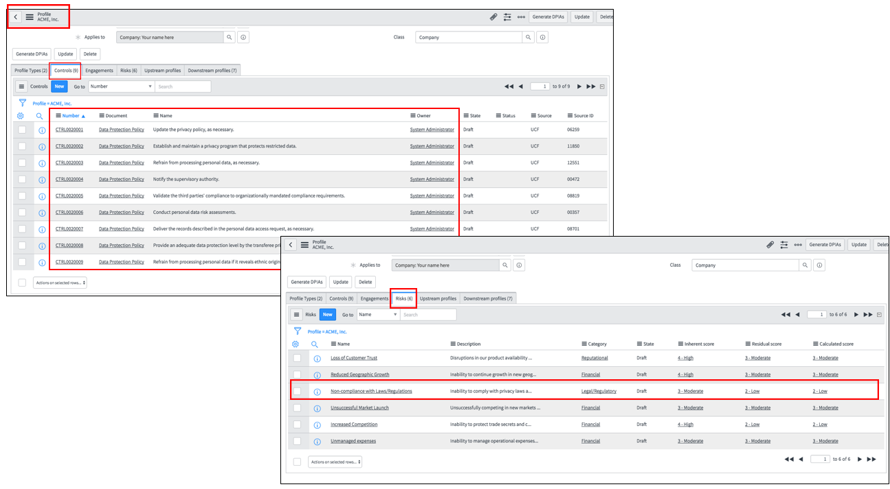    

13. Click **Risks** to see the assigned Risks.

14. Click **Non-compliance with Law/ Regulations** risk.  
    You are now in the **Risk** record.

15. Change the **Risk Life Cycle** status in the form from **none** to **Not Assessed**, and then save the record.

    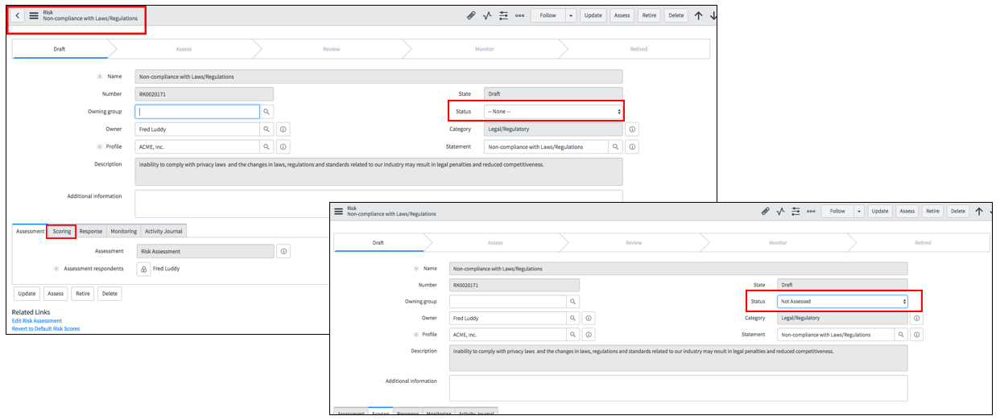
    
16. Review all the fields in this risk record.  
    i. Scroll down and click the **Scoring** tab.  
    i. Check your inherent, residual, and calculated scores. **Note** down Calculated scores! (ALE = Annual Loss Expectancy)

      

    Without having any controls implemented to reduce this risk, the likelihood to occur this risk and in turn the impact is high. The objective we want to achieve is to reduce the risk.  
    
 17. Change the **Scoring** record for **Inherent and Residual impact & Likelihood** as following:

    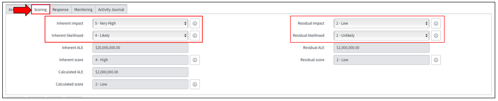

18. **Save** the record, and then **Reload** the risk record form to see new values.

19. Add controls to associate GDPR requirements to the risk.

    i.  Scroll down and go to related lists, click **Controls**, and then click **Add**.  

        A new window opens to choose controls to associate them with the risk.

    i. Select **All controls** and then click **Add Relationship**.  

       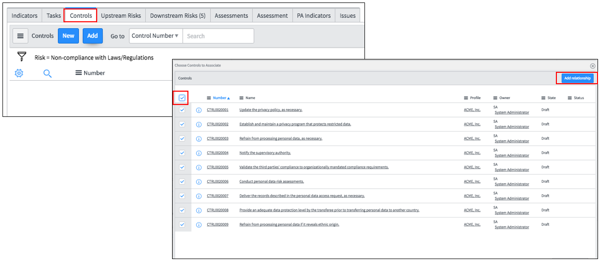  
    
       There are nine controls associated to that risk.  

    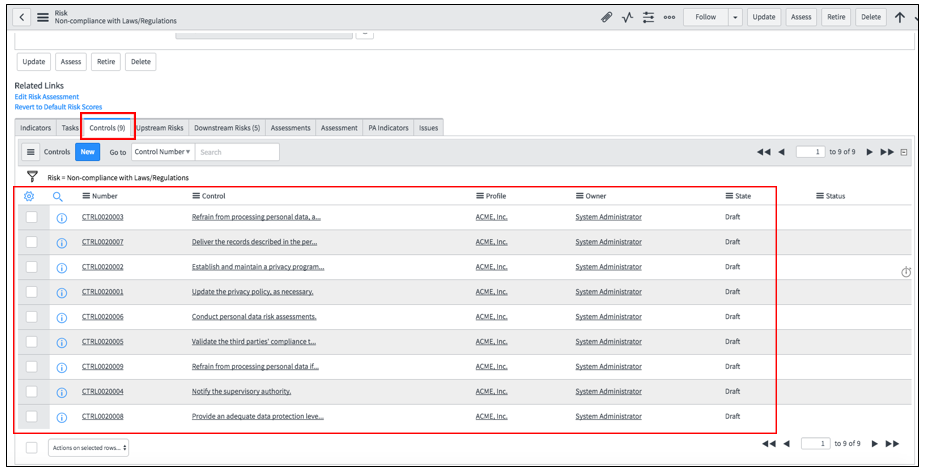
    
20. After adding these controls, save the record.  
    The risk score remains the same since you have not yet executed controls.

    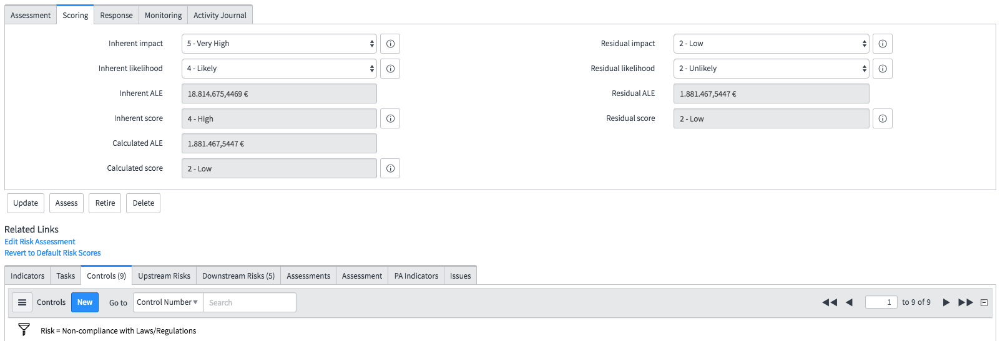

# Attestations

## Goal

As you have prepared everything to test the compliance and risk states in previous labs, let start executing. This lab explains how to generate
attestations for Data Protection requirements described in the Policy for the ACME Inc. Depending on attestations responses, controls status changes from draft to compliant or noncompliant, and has an effect on risk scoring (the more non-compliant controls, the higher the risk!).

1.  Return to your **Profile**.

    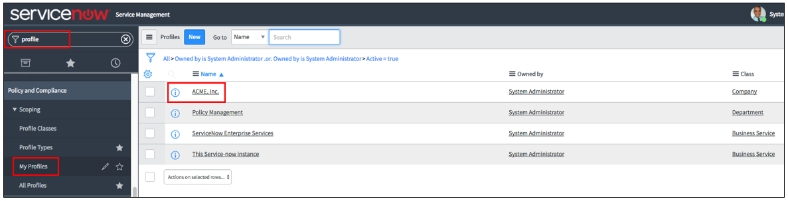

2.  Click **ACME Inc**.  
    The current state of all controls should be in **Draft**. 

3.  Click **Generate DPIAs** (Data Protection Impact Assessments, requirement from §35 EU GDPR).  
    The Controls state now changes to **Attest**.

    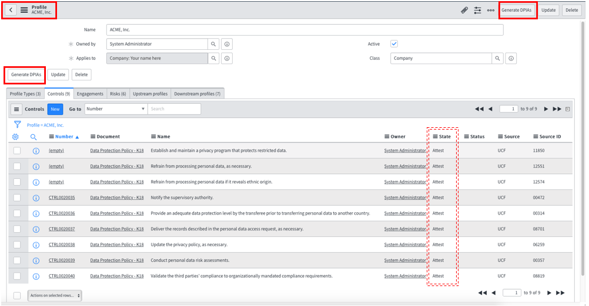    

    There are nine **attestations** created. Certainly, with ServiceNow GRC application, you can also create just one attestation by different category or different attestations by different categories for different stakeholders!

    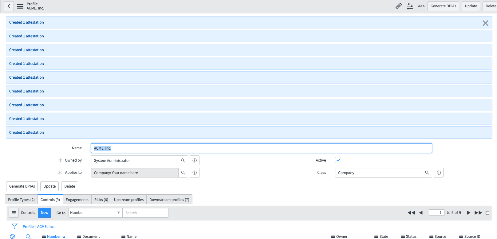

5.  In the Filter Navigator, search for **My Attestations** and then click it.

    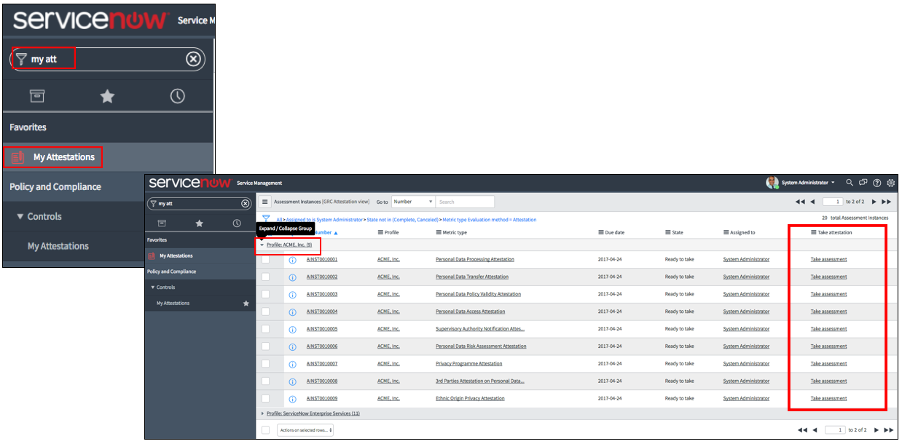

6.  Expand the **Profile ACME Inc** to see the full record.  
    You should now have nine attestations in **Ready to Take** state.

7.  Take one **attestation** and submit it. If asked to attach evidence, attach any (small size) file from your laptop. You can also provide multiple attachments for the evidence.

    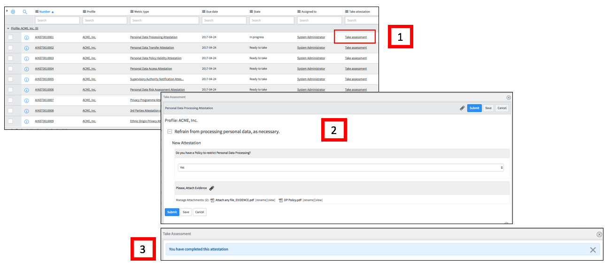

8.  Go back to the **Acme Inc. Profile**, and then click **Controls**.

    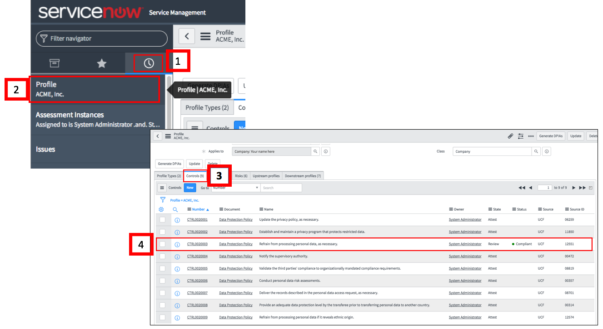  

    Depending on your response to that attestation, you see control status as **Compliant** or **Noncompliant.** 

9. Return to the Dashboard (**Compliance Overview**), and then refresh your browser.

    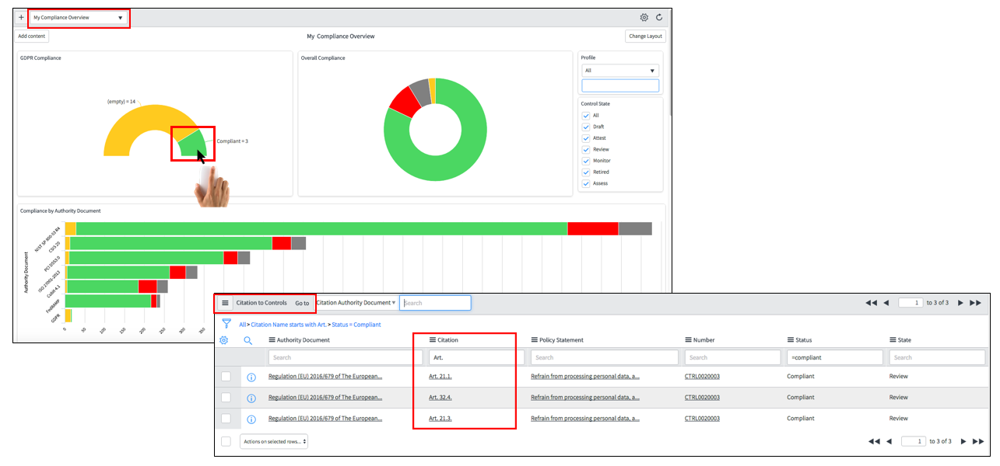

10. Note the **GDPR Compliance** status.

11. On the **GDPR Compliance** gauge, click the green part of pie chart (or red for non-compliant).  
    There are additional citations related to that particular control in **Compliant**/**Non-compliant** status.

12. Return to the attestations and take remaining attestations. <!--this is not clear to me - what does take remaing attestations mean-->

    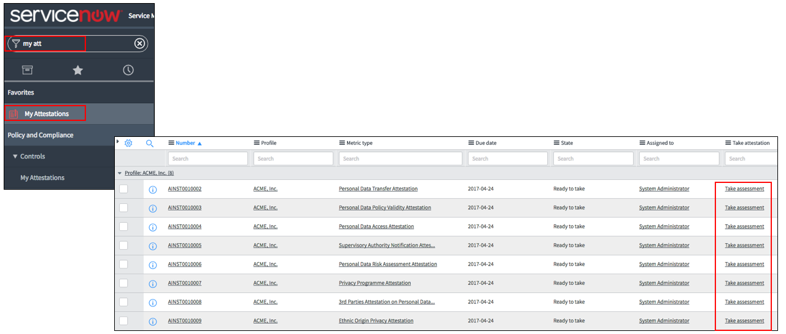
    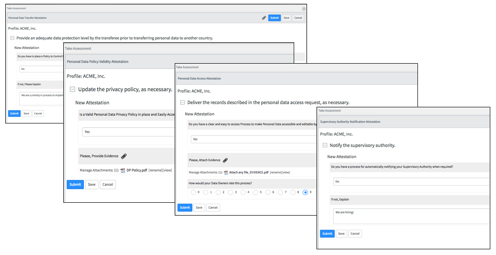

13. Check the **Controls** status time-to-time and dashboards as in the previous steps (next example).

    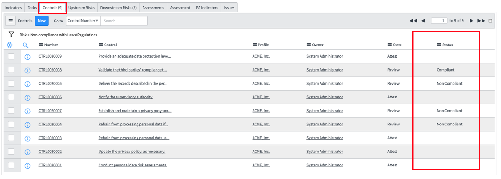
    
14. Check the **Compliance Overview** Dashboard.  
    Your dashboard might look different than what is shown below. You may need to refresh your browser window.

    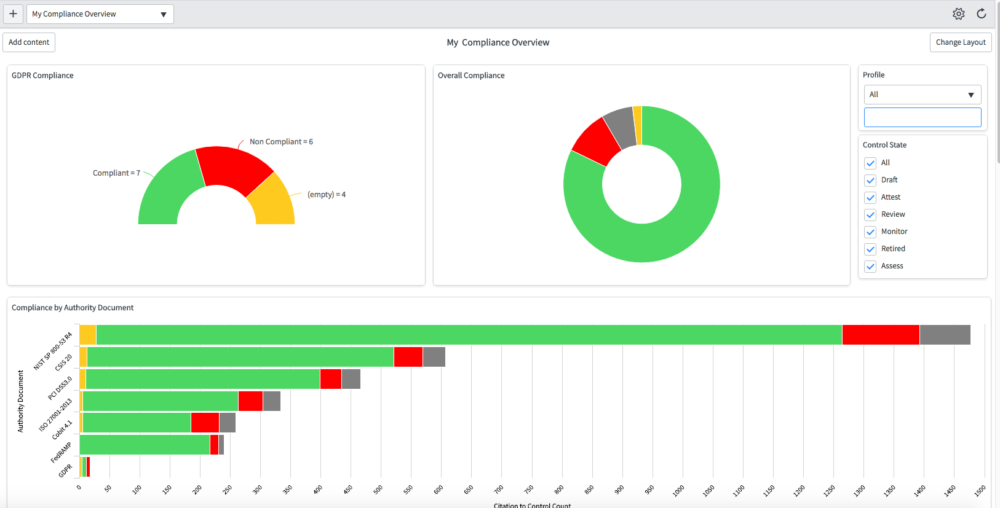

15. After having 2-3 noncompliant controls, check the risk status as described in following steps:

    i.  Go to **History** Icon
    ().  
    
    i. Select **Profile ACME Inc**.

    i. Under the Risk tab in related lists, select the **Non-Compliance with Laws/Regulations** risk.

    i. In the **Non-Compliance with Laws/Regulations** risk window, select **Scoring**.  

    There is a new score for the risk. Because of some noncompliant controls, **Calculated Score** is now higher. You may have a different score than shown below.

    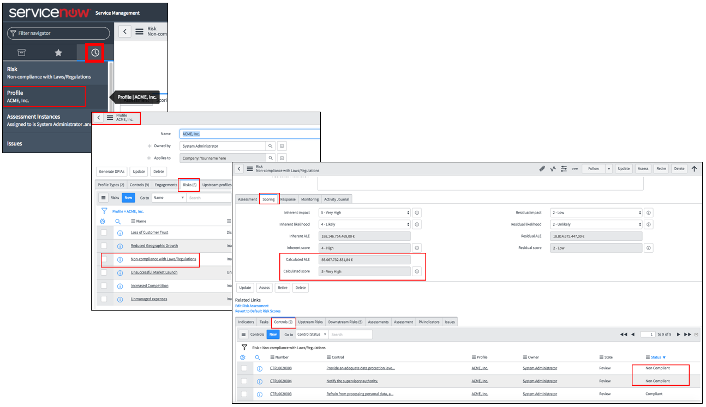
    
16. After finishing all attestations, go back to the dashboard to see the latest status of **GDPR Compliance**.  
    Your dashboard might be different than what is shown below.
    
    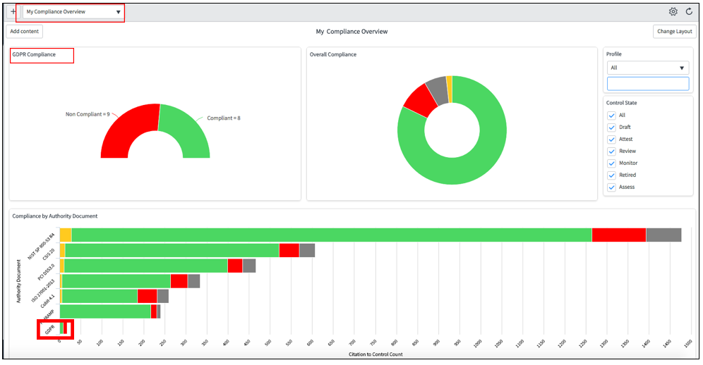

17. Go back to your risk - Non-compliance with Laws/Regulations, while finding it to the history icon.

    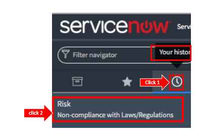

18. Check the final risk **scoring**.

19. Click the **Monitoring** tab to see the control compliance metrics.

    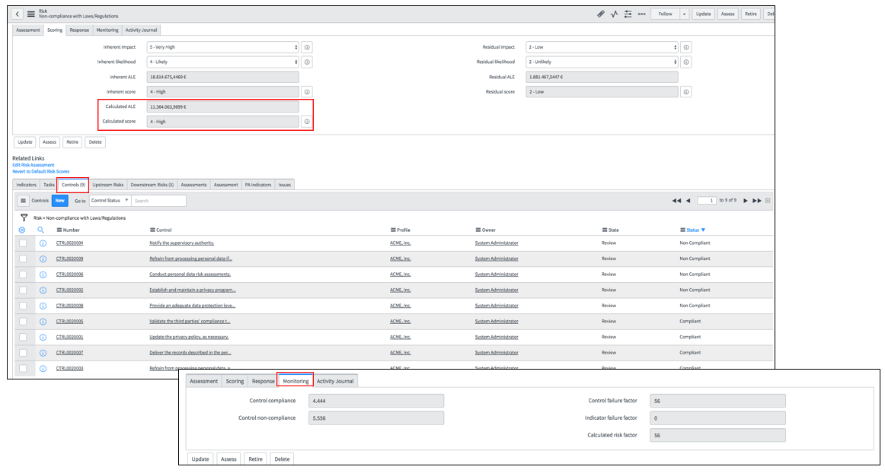

20. Scroll down and locate one of the noncompliant controls (if you have any) by clicking the **Controls** tab in the related list. 

21. Click the **Name** of a noncompliant control.

    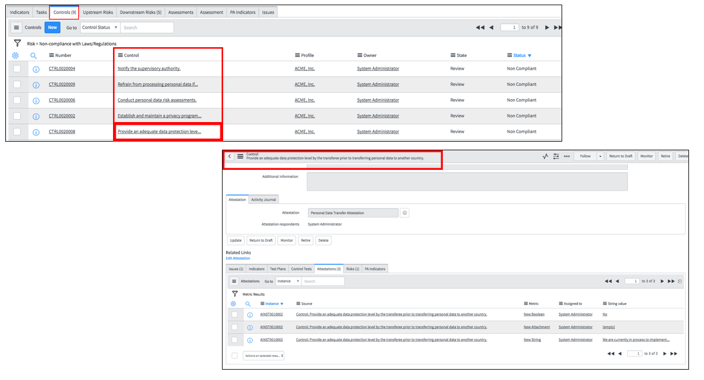

24. In the related list, click the **Issues** tab.  
    An issue is automatically generated as a result of this noncompliant control. 
    
25. Open the issue record.  
    The record is in the **New** state in the Life Cycle (next example).  

    Under the **Details** tab, the reason appears in the **Description** box. Now, an assignee can start working on resolving the issue (not part of this lab).  
    
    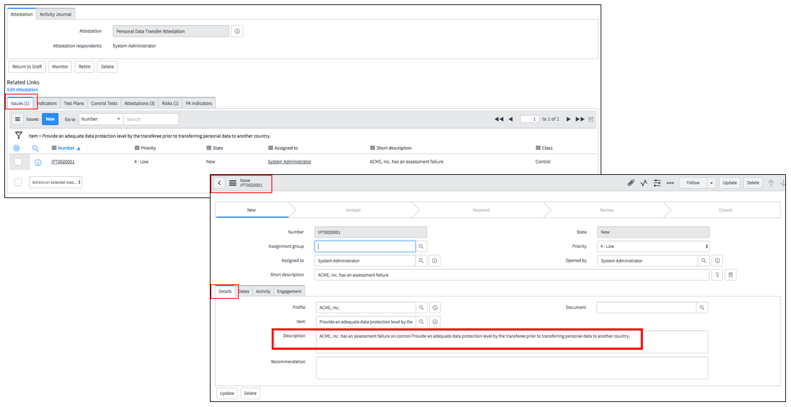
    
You can also check out the **Task SLA** information under related lists on this form.

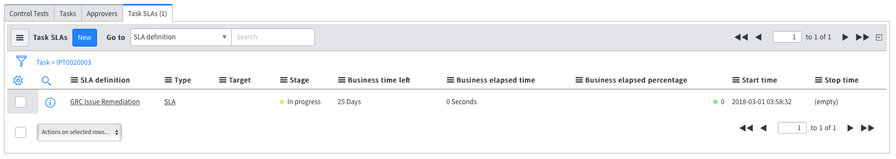

# Risk Dashboard

## Goal

This lab explains how to create and add new content to the Risk
Dashboard to get visibility on high impact risks instantly.

1. In te Filter Navigator, search for **Risks**.

2. Click **All Risks**. 

3. Filter the Risks records by **Profile: ACME Inc.** as shown below.  
   All the risks related to **ACME Inc** are listed (not in retired stage). **Non-compliance with Laws/Regulations** is also listed.

    
    
4. Make the following changes to see these risks by **Calculated Score** in the Risk Dashboard.

    

5. Right-click the **Calculated Score** field and then select **Pie Chart**.

      

   A new window opens. 

6. Enter the report name in **Report Title** (e.g., **ACME Risks**) field and then click **Save**.

    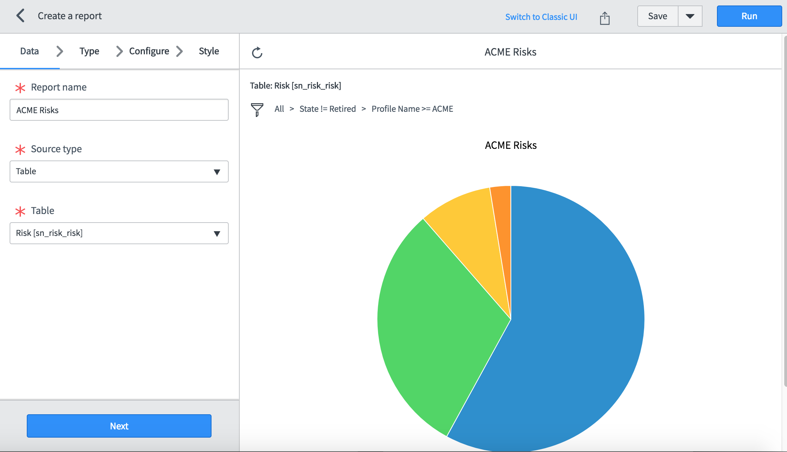

7.  On the **Style** tab, check the box **Display Data labels**.

    

8.  At the top-right of the report window, click **Save** and review the **ACME Risks** report.
    
    

9.  Select **Add to Dashboard** by clicking on the **Sharing** button on the top gray banner.
    
    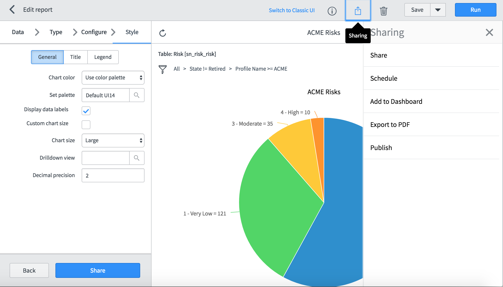

10. Add to the report on your Homepage **(Risk Overview)** as shown below.

    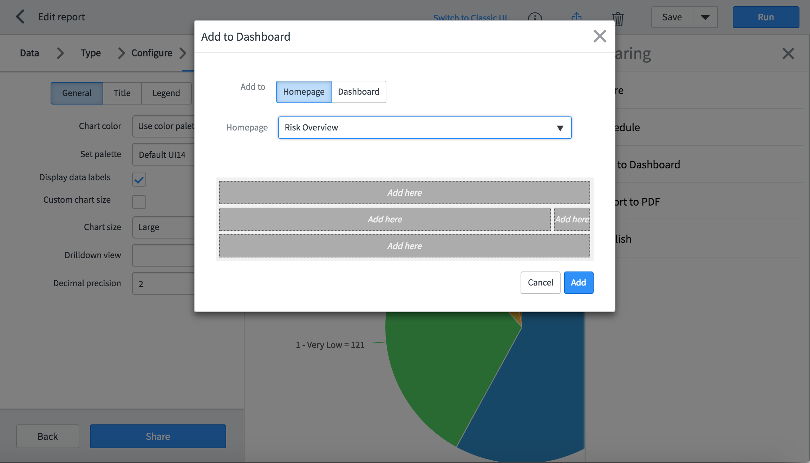

    You are automatically directed to the **Risk Overview** homepage.

    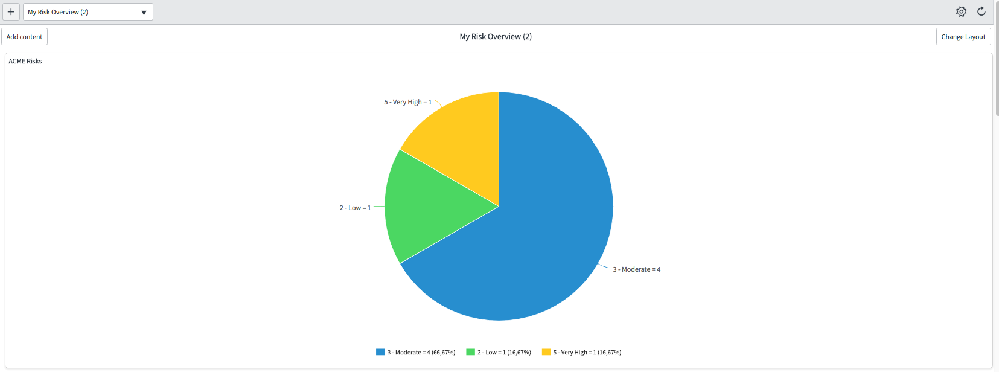  

# DPO Dashboard and GRC Portal

## Goal

This lab illustrates further elements -- DPO Dashboard, Portal, etc. - of the overall GDPR Lab. The DPO dashboard gives you as a DPO (or controller or processor) full visibility and transparency on current GDPR exposure.

1.  In the Filter Navigator, search for **Dashboard**.

    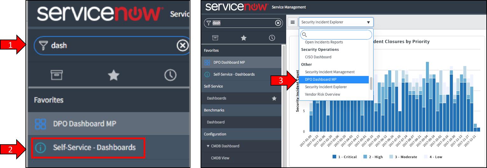
    
2.  In the **Dashboard** dropdown menu, search for **DPO** and then select **DPO Dashboard MP(v5)**.

3.  Review the different **tabs** on this dashboard:

    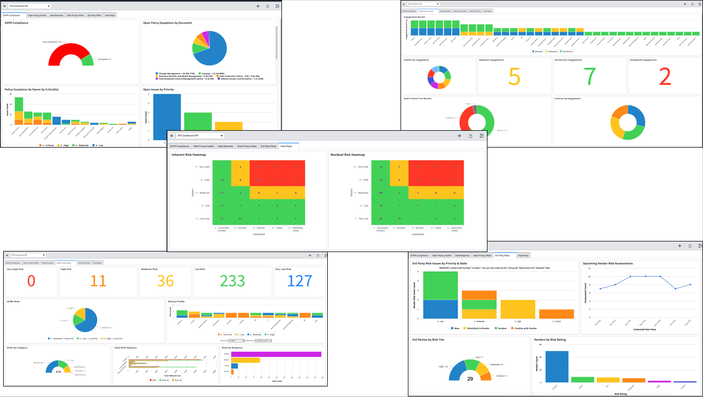

    **GRC Portal:** Illustration of a GRC portal example. 
    
4.  Open a new bowser window with:  
    Your Instance URL/grc_portal

    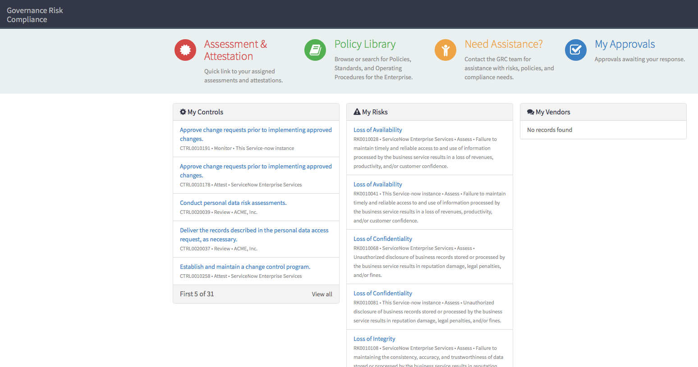
